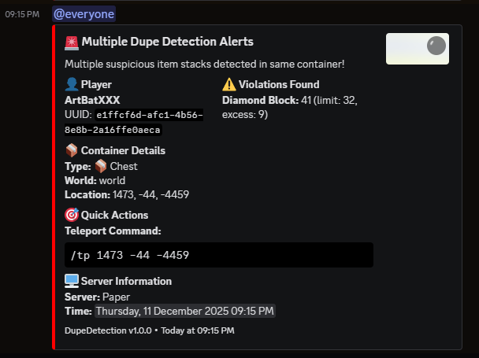

# DupeDetection Plugin

A powerful Minecraft Paper plugin designed to detect and prevent item duplication exploits on your server.

## 🚀 Features

### 📦 Large Stack Detection
- Detects when playerlargecessive amounts o stacks
- Configurable limits for each item tye (e.g., max 512 diamonds, 8 netherite inChecks Monitors all storage containers: chests, barrels, hoppers, furnaces, etc.
- Counts total items across ALL inventory slots

### 🔍 NBT Duplicate Detection
- Identifies suspicious identical items with same enchantments/modifications
- Individual configuration per item type
- Smart detection: only flags items with speduplicate cial NBsdata (snchanted, named, etc.)
- Catchesgear & itemse enchanted gear

### 🔔 Discation
- Real-time Discord webhook embedsns with rich embeds
iate admin attention
- Detailed violation reports with player info, location, andPutsort commands
- Groups multiple violations from same contain

er into single message
Ecxcemptseption System
- Whitelist specific players or UUIDs fl dupe checks
- JSON-based storage for persistent exthroughtions
- Easy management via in-gands
- Tab completion support

## 📋 Requirements

- **Minecraft Version**: 1.21.8
- **Server Software**: Paper (or Paper-based forks)
- **Java Version**: 21+

## 🛠️ Installation

1. Download the latest release from [Releases](https://github.com/CassidyMabey/dupedetection/releases)
2. Place the JAR file in your server's `plugins/` folder
3. Restart your server
4. Configure the plugin in `plugins/DupeDetection/config.yml`

## ⚙️ Configuration

### Discord Setup
```yaml
discord:
  enabled: true
  webhook-url: "YOUR_DISCORD_WEBHOOK_URL"
  mention-everyone: true
  username: "DupeDetection Bot"
```

### Large Stack Limits
```yaml
large-stack-detection:
  enabled: true
  action: "WARN"  # LOG, WARN, REMOVE_EXCESS, BAN
  limits:
    DIAMOND: 512
    NETHERITE_INGOT: 8
    ELYTRA: 1
```

### NBT Duplicate Detection
```yaml
nbt-duplicate-detection:
  enabled: true
  items:
    DIAMOND_SWORD:
      minimum-duplicates: 10
      action: "WARN"
      check-nbt: true  # Only check enchanted swords
```

## 🎮 Commands

| Command | Description | Permission |
|---------|-------------|------------|
| `/dupedetection info` | Show plugin information | `dupedetection.admin` |
| `/dupedetection reload` | Reload configuration | `dupedetection.admin` |
| `/dupedetection limits` | Show current stack limits | `dupedetection.admin` |
| `/dupedetection setlimit <item> <amount>` | Set item limit | `dupedetection.admin` |
| `/dupedetection check <player>` | Manually check player | `dupedetection.admin` |
| `/dupedetection exception add <player>` | Add exception | `dupedetection.admin` |
| `/dupedetection exception remove <player>` | Remove exception | `dupedetection.admin` |
| `/dupedetection exception list` | List exceptions | `dupedetection.admin` |

**Aliases**: `/dd`, `/dupedect`

## 🔐 Permissions

- `dupedetection.admin` - Full plugin access (default: op)
- `dupedetection.bypass` - Bypass all dupe detection (default: false)

## 🔧 How It Works

### Detection Triggers
- **Storage Container Close**: Chests, barrels, hoppers, furnaces, etc.
- **Player Inventory Close**: When players close their inventory (5-second cooldown)

### Detection Process
1. Player closes container/inventory
2. System scans all items in the inventory
3. Checks against configurends Discord notification if violations found
5. Notifies online operators (no message to violating player)

### Stealth Operation
- **No playerl* - violators are unaware of detection
- **Silent monitoring*Ely asdmins receive alerts
- **Comprehensive logging** - all activity tracked

## 🚨 Discord Notifications

Rich embed notifications include:
- **Player Information**: Name, UUID, avatar
- **ViolationTeleport command, limits exceeded
- **Location Data**: Exact coordinaning-based detection

---

**⚠️ Note**: This plugin is designed for Paper servers. Bukkit/Spigot compatibility is not guaranteed.

**Made with ❤️ by notauthorised**
ur server.

## License
[Add your license here]